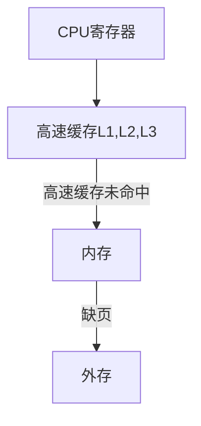
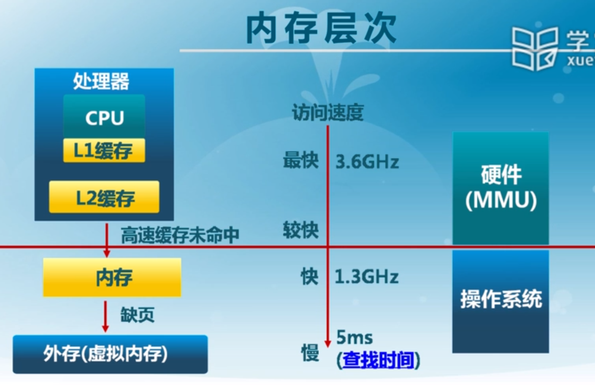
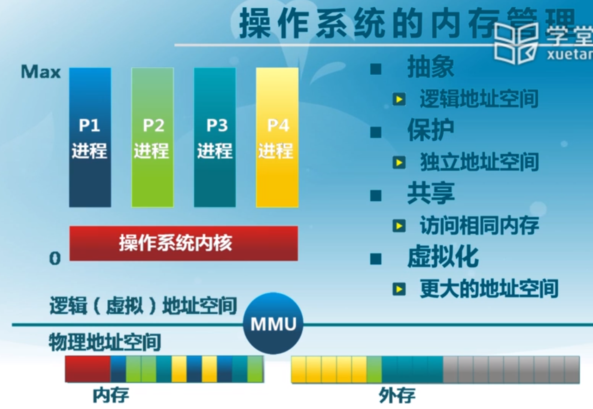
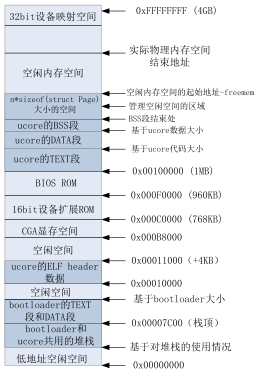

# 物理内存管理
---
[TOC]

## 待解决问题
- bootmain()具体实现功能
- entry.S如何构建C运行环境堆栈，实现C的调用栈并把之前执行的boot函数指针压栈么？
- 物理内存分配的实际做法
## 计划
- 3.3.4在做实验二练习一时再看
- 3.3.5.4做练习二时再看
- 3.8在做实验二扩展练习时再看
- pmm_init()函数中详细执行内容选看

# 理论部分

## 内存管理
### 操作系统内存访问流程：

>- 访问速度差距极大，CPU访问高速内存的速度等于CPU主频（如3.6GHz），访问内存速度稍低（如1.3GHz），访问外存速度极低（如5ms）
>- CPU访问高速缓存，当高速缓存中没有（未命中）则访问内存，内存中没有（缺页）则访问外存。
>- 其中访问高速缓存和内存的步骤由硬件控制，缺页访问外存则是操作系统控制。



**物理地址空间组成**：物理地址空间由内存+外存组成，两者线性组合成物理地址空间。  
**逻辑地址空间组成**：逻辑地址空间由所有进程共有的操作系统内核和各自进程独立的进程空间组成，即每个进程除了可以访问自己的进程空间外，还要能访问操作系统内核空间获取所需内容，但不允许访问其他进程的空间。  
**内存管理的目的**：将上述的逻辑地址空间转换成物理地址空间（**抽象**），并实现对各自进程空间的独立**保护**，**共享**多个进程需要的资源及空间例如操作系统内核，对物理地址空间进行**虚拟化**使得不同进程可以访问相同的逻辑地址，并且提供更大可访问空间。


### 内存管理方式
- **重定位**：把程序整体搬到一块新空间，即段基址+段偏移；
- **分段**：把重定位的一整个大段再分为数据段DS，代码段CS，堆栈段SS等各个段，这些段相对独立；
- **分页**：把分段后的段内容再用分页的，最小的存储单位；
- **虚拟存储**：目前多数系统（如Linux）使用按需页式虚拟存储；
- **内存管理实现**：高度依赖硬件，例如硬件MMU单元，CPU寻址方式会对内存管理实现造成影响，内核做的事情是生成逻辑地址和物理地址的映射表，实际的转换过程由硬件的MMU单元进行。

### MMU：内存管理单元

MMU：内存管理单元(Memory Management Unit)，CPU中用于管理虚拟存储器和物理存储器的控制线路，也负责虚拟地址映射为物理地址，提供硬件机制的内存访问授权。有虚拟存储器的机器上，虚拟地址不再直接送到内存地址总线上，而是送到MMU中映射成物理地址，再访问。

x86架构中MMU涉及的寄存器：GDT, LDT, CR0~ CR3, SEGMENT REGISTER

- GDT和LDT都是段式内存管理的寄存器，GDT还负责特权级切换控制。

- CR0~CR3都是控制寄存器，其中与内存管理相关的是CR2和CR3，CR2用于报告页异常错误，出现缺页异常时CPU检查CR2确定出错页面地址，CR3又称PDBR（页目录基址寄存器），存放页目录机制，二者用于页式内存管理。

  >  每个进程都有一个自己的页目录表，内核也有一个自己的页目录表，切换进程时需要将相应进程的页目录表基地址加载进CR3寄存器。

- 工作方式：CPU访问内存时，将要访问的虚拟地址交给MMU，通过MMU转换成物理地址并放上地址总线然后访问，当MMU发现访问地址不存在时向CPU发送缺页异常。

- 待补充：
  - MMU如何将虚拟地址转换为物理地址？
  - 物理页表在其中扮演了怎样的角色？物理页表和MMU无关，是操作系统建立，供操作系统使用的页表。与MMU有关的是虚拟页表，每个进程都有一个自己的虚拟页表，切换进程时需要同时切换虚拟页表，并加载如MMU单元的CR3寄存器。

### 逻辑-物理地址转换

编译过程中逻辑地址到物理地址的转换一直在变，例如：
1. C语言中设置一个函数foo()；
2. 编译成汇编指令jmp _foo；
3. 汇编成机器指令jmp 75；
4. 使用连接器和其他文件连接后前面0~100放了函数库和其他文件中的代码，则指令变成jmp 175；
5. 程序加载时执行重定位到1000的起始地址，则指令变为jmp 1175。

程序生成的时机有三种：
1. 编译时：程序在编译时就定死了起始地址，单片机就是这种模式；
2. 加载时：编译时起始位置未知，加载时生成绝对地址，无虚拟内存的操作系统使用该方式（即不存在缺页异常，页交换出入内存）；
3. 执行时：执行时代码可移动（即有缺页异常，执行到了发现不再内存则从外存移入，移入哪个起始地址不一定，可能挂起，执行过程中多次移入移出到不同地址）；该方式需要地址转换（映射）的硬件支持(MMU)。有虚拟内存的操作系统使用该方式。

在生成逻辑地址时，进行地址映射并访问前要进行地址检查，检查段界限越界则返回内存异常，该检查由操作系统进行，操作系统可以设置段基址和段界限，并进行检查。

本章所讲的都是对物理地址的处理，这里的转换是实现2、3两章物理、虚拟地址管理后的实例。

## 连续内存分配算法

### 基本定义
**连续内存分配算法定义**：给进程分配一块不小于制定大小的连续物理内存区域
**内存碎片定义**：

- **外部碎片**：分配单元间未被使用的；
- **内部碎片**：分配给进程的单元内部的未被使用的内存（进程要求510B，但只能分配512B，32位系统4B对齐）。

**动态分区分配定义**：加载执行时分配一块制定大小可变分区，分区地址连续；
### 动态分区分配
**需要维护的数据结构**：已分配分区，空闲分区。

**分配策略**：
- **最先匹配(First-fit)**：分配地址空间中最先找到的空闲块。
- **最佳匹配(Best-fit)**：分配比要求大小大的最少的空闲块，即把空闲块从小到大排，分配第一个符合要求的。
- **最差匹配(Worst-fit)**：分配空闲块中最大的块，即把空闲块从大到小排，分配第一个，如果第一个都不符合要求就说明没得分了。
> 分配策略主要需要考虑的因素是系统开销：
>- **查找开销**：最佳匹配后期剩的小块多后查找开销大；最先匹配高地址有大块空间，分配大块时开销大。
>- **合并开销**：最佳匹配和最差匹配空闲表不是按地址存的，合并时查找地址相邻块的开销大。
>- **空闲表维护开销**：最佳匹配和最差匹配空闲表按大小排，合并后插入时按大小插入，开销大。

### 碎片整理
**定义**：通过调整进程占用的分区位置来减少或者避免碎片；

**碎片整理的方法**：碎片紧凑和分区对换；

**碎片紧凑**：通过移动分配给进程的内存分区合并外部碎片；
>- 只有当所有应用程序都是可动态重定位的才能进行碎片紧凑，不然如果有程序需要访问绝对地址会出错；
>- 只能移动处于等待状态的进程；
>- 执行碎片紧凑时也要考虑开销问题。
**分区对换**：通过抢占并回收处于等待状态进程的分区，增大可用内存空间。将等待状态的进程对换到外存中留出空间给需要运行的内存；

### 连续内存分配实例：伙伴系统(Buddy System)
- 伙伴系统整个可分配的分区大小为2^u；
- 数据结构：空闲块按大小和起始地址组织成二维数组，初始状态只有一个2^u的空闲块；
- 分配分区时由小到大再空闲块数组中找到最小的可用空闲块，过大则二等分直到成为合适的2的整次幂大小，如需要大小为s( 2^u-1 < s <= 2^u )的分区，则分配2^u;
- 合并时只有相邻的同大小的分区才能合并成一个空闲分区，且合并两个大小为2^i的分区时起始地址较小的块的起始地址必须是2^(i+1)的倍数（防止中间两个合并导致两边剩下两个，如128 256 128。）
- linux、unix中都有Buddy System的实现，用来做内核里的存储分配。
- linux内核管理页面使用了伙伴系统和slab算法两个算法，以伙伴算法为基础，在伙伴系统的基础上运行slab算法

## 非连续内存分配算法
### 概述
连续分配算法缺点：
- 分配给程序的物理内存必须连续
- 存在内外碎片
- 动态修改困难
- 内存利用率低

非连续分配的设计目标：提高内存利用率和管理灵活性
- 允许程序使用非连续的物理地址空间
- 允许共享代码和数据，例如同一个函数库放入内存多个进程一起用；
- 支持动态加载和动态链接（内存可以动态分配）

非连续分配需要解决的问题：
- 如何实现虚拟地址到物理地址的转换
    - 软件实现：灵活，开销大；类似数据结构中的外排序，只读入需要执行的部分，其他部分放硬盘；
    - 硬件实现：够用，开销小；频繁转换，操作较单一重复；

非连续分配到硬件辅助机制
- 如何选择内存分块大小
    - 段式存储管理(segmentation)
    - 页式存储管理(paging)

非连续分配算法和连续分配算法的区别：
- 连续分配算法由CPU直接访问物理地址，而非连续分配算法则是CPU先访问段表或者页表在访问物理地址；
- 在访问中间加上一层段表或者页表后就会出现访问次数增多、表项占据物理地址空间大小等问题；

### 段式存储管理
- 每个进程有一个自己的段表不同进程的段表可以指向同一个段；
- 段可以有特权级；
- 组织方式：一个进程空间分成若干个互相独立不干扰的段，例如：主代码段、子模块代码段、堆数据(heap)、堆栈段(stack)、公用库段、符号表等；
- 访问方式：逻辑地址由段号（段选择子）+段内偏移组成，访问时根据段号索引段表（GDT）中的段描述符，然后MMU硬件单元判断便宜是否大于段界限越界，越界返回内存错误，不越界则段基址+段内偏移得物理地址。
- 段式存储管理是由Intel设计的，目前操作系统大多未使用；
- linux系统内核未用到段式管理，逻辑地址=线性地址，直接使用页式管理内存空间；

### 页式存储管理
- 组织方式：
    - 页帧(frame)：页式存储管理将**物理地址**分成多个大小为2的整次幂的等大内存块，页帧由**帧号f**和**帧内偏移o**组成，表示为二元组(f,o)，所以**物理地址**=f<<S+o,S为帧内偏移0的位数；
    - 页面(page) ：页式存储管理将**逻辑地址**分成多个大小为2的整次幂的等大内存块，页面由**页号p**和**帧内偏移o**组成，表示为二元组(p,o)，所以**逻辑地址**=p<<S+o,S为帧内偏移0的位数；
    - 页表(frame)：page到frame的映射中页内偏移o一般相等，帧号f和页号p不等，f和p的映射保存在页表；
    - 页面和页帧大小相等，目前一般(Linux)为4KB，业内偏移一般相等不用映射；
    - 存储管理单元(MMU)和快表(TLB)：根据页表，使得逻辑到物理地址的转换高效的进行；
- 访问方式：根据逻辑地址(p,o)，在页表中以p为下表寻找相应的页表项，即`页表项=*(页表基址+p)`，页表项大小固定，其中存储的多个信息中有p对应的帧号f，然后即可得到物理地址(f,o)；
- 页表结构：    
    - 每个进程都有一个自己的页表；

    - 每个页面对应一个页表项；

    - 页表随进程运行状态动态变化；

    - 页表基址存在**页表基址寄存器(PTBR)**中；

      > x86中控制寄存器CR0~3中的CR3又称PDBR（页目录基址寄存器），CR2用于报告页异常错误，出现缺页异常时CPU检查CR2确定出错页面地址。所以CR2和CR3用于分页机制。

    - 页表项由帧号和大量页表项标志构成；较长用的标志位如：存在位：对应物理页帧是否存在，修改为：页面是否被修改，引用位：页面是否被引用、访问。
- 存在的问题：
    - 访问一个内存单元要两次内存访问，一次获取页表项，一次访问数据；
    - 页表可能很大；
- 解决方法：
    - 缓存机制：采用快表，将常用页表放入缓存：
    - 间接访问：采用多级列表；
- 快表(Translation Loo-aside Buffer,TLB)
    - 将近期使用的**页表项**存入CPU缓存，访问物理地址时先进TLB查找有没有匹配表项，找到直接访问物理内存，找不到再去内存的**页表**中逐个找页表项、访问数据；
    - 快表使用**关联存储**(associatiove memory)实现，CPU中的**关联存储器**可以同时访问快表中的所有表项，快速匹配；
    - 快表容量小、成本高、功耗大（StrongARM上快表功耗占27%）。
- 多级页表
    - 通过间接引用将页号分成k级建立页表‘树’；如(p,o)->(p1,p2,p3,o)，pn：n级页表；
    - 多级页表访问物理内存需要访问k+1次，增加了访问次数，减少了页表长度；
    - 如果所有页表项都存在，则用多级页表不减少存储，但一般用不完，这种情况下可以使用存在位标志省掉不存在的页表项，有效减少页表大小；
- 反置页表
    - 目的：减少页表占用的存储空间；
    - 方式：将页表和物理地址空间的大小对应，而不再于逻辑地址空间对应；
    - 优点：页表大小占物理内存很小一块，且与逻辑地址空间大小无关；
    - 缺点：反置页表跟物理地址对应后需要根据帧号找页号，很麻烦；
    - 地址转换方法：对进程PID和逻辑地址进行Hash变换并解决冲突和快表两种方式一起使用；

        >- ***具体如何Hash变换还不清楚，要看过代码才知道；*** 
    - 页寄存器：只对逻辑地址进行Hash变换，不变换进程PID。

### 段页式存储管理 
- 在段式存储管理的基础上给每个段加上一级页表；
- 访问：先访问根据段号访问段描述符，找到段基址，再根据段基址和页号找到物理地址；
- 内存共享：使用段页式进行内存共享较为容易，在两个进程各自的段表中添加一个相同的共享段的段描述符，然后让不同的进程都指向该段相同的页表基址，实现进程间的段共享；
- 逻辑地址通过段式管理转换为线性地址，线性地址通过页式管理转换为物理地址；
- 逻辑地址是针对x86架构形成的地址，系统用不到，应用开发就也用不到，未使用段式管理的系统的应用中使用的地址是线性地址；

### 调试工具
实际linux操作系统中，可以使用ps命令获取进程号，然后再/proc/进程号/maps文件中查看进程地址空间信息，这里显示的是线性空间地址（或者说是逻辑地址）。如果运行两个相同的程序，其地址空间信息会完全一样。


# 实验部分

## 相比lab1添加的内容
- bootasm.S中添加系统内存探测工作
- bootmain.c中不再直接调用kern_init()，而是先调用entry.S
- pmm_init()中添加分页内存管理功能

## lab2系统主要完成的工作
- 初始化显示终端、键盘等输入输出设备
- 中断初始化和定时器初始化
- 【新增内容】物理内存探测与管理


## 物理内存管理
32bit物理内存举例：0x12345678，其中每个数字表示4bit，8个数字即32bit，所以后30bit表示G，最高2bit表示0~3G，所以4G空间可以如下表示：
地址|高4bit|dec
---|---|---
0x00000000|0000|0G
0x40000000|0100|1G
0x80000000|1000|2G
0xC0000000|1100|3G

### 物理内存探测
探测方法分类：
- 保护模式下：直接探测；
- 实模式下：BIOS中断调用，通过 BIOS 中断获取内存布局有三种方式，都是基于INT 15h中断，分别为88h e801h e820h。但是并非在所有情况下这三种方式都能工作。在 Linux kernel 里，采用的方法是依次尝试这三种方法。

e820hBIOS中断探测方法：
1. 使用BIOS终端调用 INT 15H,参数e820h在是模式下完成；
2. 先在eab~edx和di中写入参数，然后int $0x15;自动探测，并将结果组织成**系统内存映射地址描述符(Address Range Descriptor)**的结构写入di所在地址，然后di自增ecx寄存器的值（ucore os中是20）；
3. di设置开始于0x8004，每次自增20；所以探测结束后BIOS中断生成的**系统内存映射地址描述符(Address Range Descriptor)**即存在0x8004开始的地址中，结构类似一个数组，每个描述符大小20字节；
4. 如果探测出错会置位cflags寄存器中的进位标志位CF，然后汇编中通过jnc判断探测出错即跳转执行`cont`标签，然后返回继续探测；
5. 内核程序中探测出的描述符以`struct e820map`的形式定义在memlayout.h文件中，该结构体定义如下：
``` CPP
struct e820map {
    int nr_map;
    struct {
    long long addr;
    long long size;
    long type;
    } map[E820MAX];
};
```
该结构体存在0x8000地址处，其中其中前4字节是`nr_map`，该位在bootasm.S文件中在探测最后写成了`movw $12345, 0x8000`，也即nr_map = 12345;该变量之后从0x8004开始就是描述符数组，内部包含内存块基地址、内存大小、内存类型三个参数，其中内存类型定义如下：
```
Values for System Memory Map address type:
01h    memory, available to OS
02h    reserved, not available (e.g. system ROM, memory-mapped device)
03h    ACPI Reclaim Memory (usable by OS after reading ACPI tables)
04h    ACPI NVS Memory (OS is required to save this memory between NVS sessions)
other  not defined yet -- treat as Reserved
```

### 物理内存管理用到的数据结构
物理页帧(Frame)结构：
``` cpp
//memlayout.h
struct Page {
    int ref;        // page frame's reference counter
    uint32_t flags; // array of flags that describe the status of the page frame
    unsigned int property;// the num of free block, used in first fit pm manager
    list_entry_t page_link;// free list link
};
```
- `ref`记录虚拟页表到该物理页帧的映射项数目，每多一个映射+1，接触一个映射-1；
- `flags`是该物理页帧的标志位和属性，具体标志和属性也在memlayout.h中宏定义；
- `property`用于记录连续内存空间大小即连续空闲页帧个数，仅每个空闲内存块的头页帧（地址最小的一页）用到该成员变量；
- `page_link`也仅头页帧（地址最小的一页）用到；
分配然后释放的空闲物理页帧使用`free_area_t`记录；
```cpp
/* free_area_t - maintains a doubly linked list to record free (unused) pages */
typedef struct {
    list_entry_t free_list;        // the list header
    unsigned int nr_free;          // # of free pages in this free list
} free_area_t;
```
- `free_list`指向空闲页帧；
- `nr_free`记录空闲页个数
有了这两个数据结构，ucore就可以管理起来整个以页为单位的物理内存空间。

### 以页为单位的物理内存管理
定义好`struct Page`和`free_area_t`两个结构体后，在pmm.c文件中使用`page_init()`函数初始化管理物理页帧。具体步骤如下：
1. 获取使用BIOS中断探测到的物理内存情况`struct e820map`；
2. 遍历整个内存的e820表，找到最后一内存类型为01h（即可以被系统使用）的内存，结束位置作为整个内存块的结束位置，也是整个内存块的大小`maxpa`（起始位置默认0）；
3. 将整个内存块除以页大小`PGSIZE`得到页帧数`npage`；
4. 设置管理页级物理内存的页表的起始地址`pages`，起始地址设置为从系统代码段结束处地址`end`开始，为了页对齐，所以对(end+PAGESIZE-1)-(end+PGSIZE-1)%PGSIZE后再赋值给pages，计算由宏定义`ROUNDUP(a,n)`完成；

    > 计算举例：如果end为10，PGSIZE为4K即4096，则pages=(10+4096-1)-(10+4096-1)%4096=4105-4105%4096=4105-9=4096，第一页为0~4095，前10B被系统代码占据，所以不能使用，所以从第二页起始地址4096开始作为页表的起始地址。
5. 将所有探测到的页都先设置为仅内核可用，不允许alloc/free，通过宏定义`SetPageReserved(page)`调用内联函数汇编`set_bit`最终使用扩展内联汇编设置该位置位，到这里为止还都是直接访问、操作物理地址；
6. 设置完所有页之后将页表结束位置作为空闲内存块的起始地址赋值给`freemem`；
7. 如果探测到的e820数据表中的起始地址和结束地址不在`freemem`和最大地址宏定义`KMENSIZE`范围的，则设置为`freemem`和`KMEMSIZE`，在该范围内则`begin `向上、`end`向下对PGSIZE取整作为起始结束地址，然后将起始地址和页大小作为参数初始化页表项；
   > 初始化的具体方式：`begin>>12=begin/4K`，作为`pages`页表数组的数组下标索引页表项，页大小为`(end-begin)/PGSIZE`即页帧个数，输入`init_memmap()`，函数初始化相应页表项（之前全部页表都设置为01h reserved了，不能被alloc/free，想用的话需要重新初始化所有页表。而初始化函数`init_memmap()`是`struct  pmm_manager`结构体的一个成员函数指针，可以自行编写不同的初始化函数，把选择使用的赋值给该成员指针即可使用。
   > `init_memmap()`函数的主要作用：初始化首地址为`pages`的物理页表中的一项，清标志位，清ref，加入`free_area_t`链表；

### ld工具和.ld文件
详见`boot.ld`和`kernel.ld`文件，ld工具根据相应.ld文件进行链接工作。
- ENTRY()内设置链接文件入口地址；
- SECTIONS{}内设置程序布局；
- .表示当前内存地址，`. = 0xc0;`设置当前地址；
- PROVIDE()内设置一个全局变量并赋值，一般赋值为`.`即当前地址，链接程序中可以使用extern引用该变量获取地址信息，例如：`PROVIDE(end=.);`使用`extern char end[]`引用即可。
更详细内容根据需要百度，再添加；
- ld链接设置的是虚拟地址，在lab1中`kern_init()`函数入口在0x100000处，lab2中`kern_init()`函数的入口在0xC0100000，然而lab1中虚拟地址=线性地址=物理地址，lab2中执行`kern_init()`时未启动页表机制，虚拟地址-0xC0000000=线性地址=物理地址；所以起始内核代码的物理地址都一样为0x100000；

### 初始化后的物理内存布局

- BIOS ROM地址由Intel设定；
- bootloader的TEXT和DATA段由`boot.ld`文件设定，`ld`链接工具自动链接，但是改地址是Intel要求的bootloader存放地址0x7c00；
- ucore的TEXT、DATA、BSS段由`kernel.ld`文件设定，`ld`链接工具自动链接；
- BSS段的结束地址也是物理页表的起始地址，即`pages`存的地址；
- 物理页表的结束地址即`pages`数组的结束地址，也是空闲空间的起始地址，即`freemem`存的地址，后面就全是空闲空间了一直到`KMEMSIZE`设定的地址，ucore中是0x38000000，即总内存空间仅896MB；
- e820h探测到的可用内存表放在`KERNBASE+0X8000`处，其中`KERNBASE`为0xC0000000即3G处，

### 分页机制的建立
- 页映射的建立过程中，地址映射有三次变换，第一次在`kern_entry`前后，第二次在`enable_page()`前后，第三次在`gdt_init()`前后，`gdt_init()`之后就建立了虚拟地址、线性地址和物理地址间期望的映射关系。
- 申请一块物理页存放页目录项，然后根据需要申请页表项，并加入`free_area_t`链表；
- 物理页目录项(pde pabe directory entry)和页表项(pte page table entry)的结构都是20bit地址空间+12bitflags；
- 还有一种处理方式是不申请，而是将页表写入4MB的连续内存空间，因为是连续的，所有就省下了4KB的页目录项，这种机制称为**自适应机制**。

## struct pmm_manager:物理页面管理框架

### 结构体定义

```c++
struct pmm_manager {
    const char *name;                                 // XXX_pmm_manager's name
    void (*init)(void);                               // initialize internal description&management data structure
                                                      // (free block list, number of free block) of XXX_pmm_manager 
    void (*init_memmap)(struct Page *base, size_t n); // setup description&management data structcure according to
                                                      // the initial free physical memory space 
    struct Page *(*alloc_pages)(size_t n);            // allocate >=n pages, depend on the allocation algorithm 
    void (*free_pages)(struct Page *base, size_t n);  // free >=n pages with "base" addr of Page descriptor structures(memlayout.h)
    size_t (*nr_free_pages)(void);                    // return the number of free pages 
    void (*check)(void);                              // check the correctness of XXX_pmm_manager 
};
```

### 实验中实现的管理函数:default_pmm.[ch]

``` C++
const struct pmm_manager default_pmm_manager = {
    .name = "default_pmm_manager",
    .init = default_init,
    .init_memmap = default_init_memmap,
    .alloc_pages = default_alloc_pages,
    .free_pages = default_free_pages,
    .nr_free_pages = default_nr_free_pages,
    .check = default_check,
};
```

- default_init:初始化物理页链表
- default_init_memmap:初始化一页物理页，入参为页首地址和页大小，用于探测物理地址时探测后建立页表
- default_alloc_pages:入参为要申请的页面数量。执行流程：在初始化时建立的空闲物理页链表`free_list`中遍历，找到第一块大于申请页面数的未用内存块后，修改剩余空闲内存块的属性（如大小等），然后加回空闲链表尾部，然后返回申请页面的头指针。
-  default_free_pages:入参为要释放的内存块首地址和页数量。执行流程：清除物理页的属性（flags等），然后遍历`free_list`如果有与要释放内存物理地址连续的内存块，则合并，然后删除，没有相邻物理块则直接加载空闲链表前面。
- default_nr_free_pages:返回剩余空闲链表数量。
- default_check:做一些检测，测试前面各个函数功能是否正常，比如申请多个页面能否申请到，申请到的是不是同一个物理页，页面属性设置是否正确等等。

> 这里所执行的操作都是直接对物理地址进行操作的，没有用上虚拟地址或线性地址。

### pmm_init()函数主要工作

- 初始化物理内存页管理器框架pmm_manager；
- 建立空闲的page链表，这样就可以分配以页（4KB）为单位的空闲内存了；
- 检查物理内存页分配算法；
- 为确保切换到分页机制后，代码能够正常执行，先建立一个临时二级页表；
- 建立一一映射关系的二级页表；
- 使能分页机制；
- 重新设置全局段描述符表；
- 取消临时二级页表；
- 检查页表建立是否正确；
- 通过自映射机制完成页表的打印输出（这部分是扩展知识）；

## 练习题笔记
### 练习0
使用工具meld很方便，如果装了vscode或者git的话也可以，但是git主要做版本控制，从lab1到lab2用git还不如meld方便。

### 练习1
首先是读default_pmm.c前面的大段注释：
- 修改`default_init`, `default_init_memmap`, `default_alloc_pages`, `default_free_pages`实现最先匹配；
- 读`list.h`中的内容，主要是双向链表操作：`list_init`, `list_add`(`list_add_after`), `list_add_before`, `list_del`, `list_next`, `list_prev`；
- `default_init`：主要初始化`free_list`并且设置`nr_free`为0，`free_list`记录空闲内存块，`nr_free`是空闲块总数；
- `default_init_memmap`：初始化一块空闲内存块，入参为`addr_base`, `page_number`，初始化内存块前，需要先初始化该内存块中的每个页帧:
    - 对每个页帧，置为flags中的`PG_property`位，
- ***不想写了，需要自己看英文注释吧，照着一句一句写代码就行了，练习1~3都这样，主要就是理解虚拟地址、线性地址、物理地址，页目录项、页表项、页，各种地址址间的变换。***

### 扩展练习1~2
slub和buddy时linux用到的两种内存分配算法，看看介绍就好了，感觉自己实现的话，投入产出比太低。


# 参考文献

1. [MMU结构及工作原理](https://blog.csdn.net/jtli_embeddedcv/article/details/11967105)
2. [【Linux】Linux的虚拟内存详解（MMU、页表结构）](https://blog.csdn.net/qq_38410730/article/details/81036768)
3. [页目录和页表结构---醍醐灌顶](https://blog.csdn.net/yiyeguzhou100/article/details/72917904)