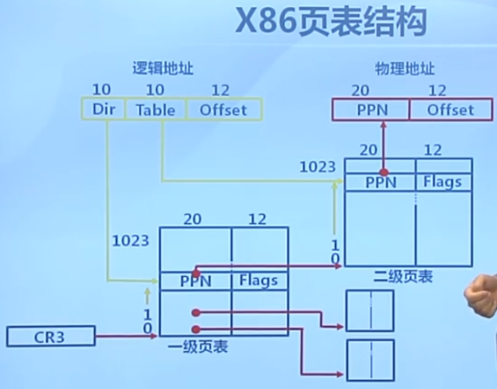

# 虚拟存储管理
[TOC]

## 概述

### 虚拟存储管理概念
计算机程序对内存的需求增速高于存储单元发展速度，所以对于内存不够的情况需要从软件上寻找均衡、优化方案，曾经和现在用到的解决方案主要有覆盖、交换和虚拟存储。

**覆盖**：早期应用程序手动识别并把需要的指令和数据保存在内存中；

- 目的：用于早期计算机内存小，不足以放入一个程序，例如程序190K,内存仅110K，放不下；
- 方法：根据程序逻辑结构，把程序分为若干个功能相对独立的模块，让不会同时执行的模块共享同一块内存区域，即减少一个进程所占用的空间，并且这块空间固定下来给该进程使用，仅进程空间内自己交换模块换入换出，而不交换其他进程进入该空间；
    - 其中必要部分（常用功能）代码和数据常驻内存；
    - 可选部分（不常用功能）放在其他程序模块中，仅使用时装入内存；
- 不足：覆盖技术由应用程序自行操作，即程序员编程划分功能模块，并由程序员调用覆盖技术接口函数，移动模块，编程复杂；时间换空间，执行时间也会增加；

**交换**：操作系统自动把不能执行的程序整个进程移出内存，以进程为单位移进移出；

- 目的：一个程序用内存空间够用，但增加新的不够；
- 方法：将暂时挂起不用的进程放到外存；
    - 交换的基本单位：整个进程；
- 面临的问题
    - 交换时机：只当内存空间不够或由不够可能的时候换出；
    - 交换区大小：外存交换区要足够放下所有换出进程映像的拷贝；
    - 重新换入时的重定位：采用动态地址映射的方法；

**虚拟存储**：通过置换算法，以页为单位自动装载所需页、移出使用率低的页。

- 物理内存+磁盘=虚拟存储
- 目标：只把部分程序放入内存，从而运行比物理内存大的程序；
    - 实现内存和外存的交换，获得更多空闲内存空间；
    - 由操作系统自动完成，无需程序员干涉；
- 实现依据（原理）：局部性原理
    - 概念：程序在执行过程中的一个较短时期，所执行的指令地址和指令的操作数地址（即代码地址和数据地址）分别局限于一定区域；
        |局部性|介绍|
        |:-|:-|
        | 时间局部性 | 同一条指令的多次执行和同一个数据的多次访问集中在一个较短的时期内 |
        | 空间局部性 | 连续执行的几条指令和连续访问的几个数据集中在一个较小的区域   |
        | 分支局部性 | 同一条跳转指令的两次执行很可能跳到相同的内存位置             |

        举例：`for(int i=0;i<100;i++)code;`，`i++`：时间局部性，同一指令连续多次执行；`code`和`i++``i<100`等：空间局部性，连续执行的指令集中在一块地址空间（一般在连续地址空间）；`i<100`：分支局部性，前100此都时跳转到相同内存位置，仅最后一次调到其他位置。

    - 局部性原理的意义：从理论上保证了虚拟存储技术时能够实现的并且能取得满意的效果；

    - **编程时要注意局部性原理**：例如循环访问一个A[1024][1024]的数组，如果能全部放内存里则无影响，但如果放不下，则要注意数组存放方式和访问方式，如：数组每行放在一页中，如果竖着遍历（访问a[0][],a[1][0],a[2][0]...）则缺页1024*1024次，如果横着遍历（访问a[0][],a[1][0],a[2][0]...）则仅缺页1024次。
- 实现方法：将不常用的部分内存块暂存到外存中；
    - 装载程序时仅装载当前指令执行需要的部分页面或段；
    - 指令执行中需要的指令或数据不在内存（缺页或缺段）时处理器通知操作系统将相应页面调入内存；
    - 操作系统将内存中暂时不用的页面或段保存到外存中（通过置换算法判断）；
    - 根据以页为单位置换和以段为单位置换，分为虚拟页式和虚拟段式两种。
- 基本特征：
    - 不连续性：物理内存分配可以非连续；虚拟地址空间使用可以非连续；
    - 大用户空间：提供给用户比实际物理空间大得多的虚拟内存；
    - 部分交换：仅对部分虚拟地址空间调入调出。
- 实现虚拟存储需要的支持技术：
    - 硬件：页式或段式存储中的地址转换机制，并且硬件要能判断所需内容不再内存中触发缺页；
    - 操作系统：完成换入换出操作；
- 虚拟页式存储管理：在页式存储管理的基础上，增加请求调页和页面置换操作；
    - 实现思路：用户程序运行时仅装入部分页面，进程中途发现不存在则向系统发出缺页异常请求，操作系统处理缺页异常（缺页服务例程）调入相应页使进程能继续运行；
        - 进程寻址到页表找不到相应页表项后触发缺页异常，操作系统处理缺页异常，调入页并设置页表项后进程继续执行；
    - 页表项结构：添加虚拟页式存储管理后需要修改页表项的结构
        - 32bitX86页表结构如下：不同处理器对应的页表结构千差万别，这里举例仅供学习理解。
        - 逻辑地址：10bit页目录项，10bit页表项，12比特页内偏移；
        - 物理地址：20bit物理页帧号，12bit标志位；
            - 物理页表的一级页表起始地址存放在CPU寄存器CR3中，各级页表项内容也和物理地址一样，是20bit物理页帧号，12bit标志位；
            - 寻址时根据逻辑地址高10bit索引一级页表中的一项，然后根据一级页目录项的高20bit索引二级页表起始地址，在找到的二级页表中根据逻辑地址中间10bit索引目标页对应的页表项，其中存的高20bit物理地址+逻辑地址后12bit页内偏移得到实际物理页中要访问项的物理地址（图见X86页表结构）；
            - 
        - 原页表项结构前20bit地址，后12bitflags，flags未用完，现在要在flags中添加四个标志位：驻留位P、修改位D、保护位、访问位A；
            - P  ：1：表示该位在内存中，0：表示该位在外存中，会导致缺页；
            - D  ：1：表示修改过，需要写回内存，如果未修改过则直接作废即可，不用写回；
            - A  ：1：表示该页面过去一段时间被访问过，用于页面置换算法统计访问频率；
            - W  ：可写标志
            - U  ：用户态标志
            - WT ：1：Write-through 0:Write-back
            - CD ：Cache Disable，高速缓存使能位，一些时效性读写如端口读写会用到
            - AVL：保留位，未用到
- 缺页异常处理流程：
    1. 进程执行指令a导致缺页异常；
    2. 操作系统开始处理缺页异常，在外存中找到相应页p；
    3. 内存中无空闲物理页继续执行；有空闲页则跳转6；
    4. 根据页面置换算法选择替换的物理页f对应的逻辑页q；
    5. 如果q被修改过则写回外存，驻留位置0；未被修改过跳过5；
    6. 将p装入物理页f，并将驻留位置1；
    7. 重新执行指令a；
    ```mermaid
    graph TB
    A[执行指令a] --> |未缺页|H[执行下一条指令b]
    A[执行指令a] --> |缺页|B[触发缺页异常]
    B --> C[操作系统在外存中找到相应页p]
    C --> |有空闲物理页f|G[装入空闲页f]
    C --> |无空闲物理页|D[通过页面置换算法找到置换的物理页f和对应的逻辑页q]
    D --> |q未被修改过直接丢弃|F[将p装入物理页f并将驻留位置1]
    D --> |q被修改过|E[将q写回外存并将驻留位置0]
    E --> F
    F --> G
    G --> H
    ```
- 外存管理：在外存中设置一块区域作为交换区；
    - 移出的页面存放在交换区中（Linux和Unix的做法）；
    - 采用特殊格式存储未被映射的页面（因为页面大小固定，可以做优化）；
    - 代码段存放在可执行的二进制文件中，无需放入交换区；
    - 动态加载的共享库程序段存放在动态调用的库文件中，也无需放入交换区；
- 虚拟页式存储管理的性能：
    - 性能参数：有效存储访问时间(effective memory access time EAT)
    - EAT = 内存访问时间*(1-p) + 缺页异常处理时间*缺页率p
    - 例：内存访问时间：10ns，磁盘访问时间：5ms，缺页率p，页面修改概率p（写回外存），则EAT = 10(1-p)+5,000,000p(1+q)

## 页面置换算法

### 页面置换算法

#### 概念

**功能**：当出现缺页异常，需要调入新页面且内存已满时，置换算法选择被置换的物理页面  
**设计目标**：尽可能减少页面调入调出次数，把未来不再访问或短期内不访问的页面调出  
**页面锁定**：有些逻辑页面必须常驻内存，例如操作系统关键部分和一些要求响应速度的代码和数据，使用页表中的锁定标志位(lock bit)锁定使其常驻内存  
**评价方法**：记录进程访问内存的页面轨迹和缺页次数，产生缺页次数少的性能更好  

#### 分类

局部页面置换算法
- 置换页面选择范围：仅限当前进程占用的物理页面内存
- 最优算法、先进先出、最近最久未使用算法
- 常用算法：时钟算法、最不常用算法（两种对最近最久未使用算法的近似）

全局页面置换算法
- 给进程分配可变数目的物理页面
- 进程在不同阶段对内存的需求是变化的，给其分配的内存也应该时变化的，全局置换算法需要确定分配给进程的页面数以及分配哪些页面给进程
- 置换页面选择范围：所有可换出的物理页面
- 工作集算法、缺页率算法

### 局部页面置换算法
#### 最优算法(optimal, OPT)

预测未来决定置换哪个页面，理论上最好的，作为置换算法的性能评价依据，无法实现

#### 先进先出(FIFO)

换出驻留时间最长的页面，要按进入顺序维护一个链表，效率低，很少单独使用

#### 最近最久未使用算法(Least Recently Used, LRU)

统计过去代替预测未来

实现方法：
   - 页面链表：首节点时最近使用过的页面，尾节点时最久未使用的；访问内存时从链表中找到相应页面并移动到首节点；缺页时置换尾节点
   - 页面栈：访问页面时页号压入栈顶，并遍历栈，抽出相同页号，缺页时置换栈底页面

复杂度较高，开销大

#### 时钟置换算法(Clock)：

思路：仅对页面访问情况进行大致统计

数据结构：页表项中添加访问位，页面组织成环形链表，指针指向最先调入的页面

访问页面时访问位置1，缺页时从指针处开始顺序查找未被访问的页面进行置换（查找到访问过的页面把访问位置0）

时钟算法是对LRU和FIFO的折中

#### 改进的Clock算法

减少修改也的缺页处理开销，其他开销不变

页面中再加一个修改位，只读置访问位为1（即10），写入后置访问位和修改位都为1（即11），且查找时11（访问位1，修改位1）变为01，再次查找时01变为00；

#### 最不常用算法(Least Frequently Used, LFU)

思路：缺页时置换访问次数最少的页面

实现：页面设置一个访问技术，每次访问计数+1，缺页时置换计数最小的页面

特征：算法开销大，开始时频繁使用但以后不用的页面计数大很难置换出去（计数定期右移衰减解决）

开销大，不适用于内存访问置换，但可用于硬盘访问等速度要求不高的地方

Belady现象：分配更多的物理页，缺页次数反而增加

### 全局置换算法
#### CPU利用率和并发进程数的关系：

- 进程数少时，并发进程数增多，CPU利用率提高；
- 当进程数增多到一定程度后，内存访问增加，降低了访存的局部性特征（一直在各进程间跳，但局部性仅存在于进程内部），局部性下降导致缺页率上升和CPU利用率下降。

#### 工作集置换算法

工作集定义：$W(t,\Delta)$
- t时当前执行时刻
- $\Delta​$成为工作集窗口(working-set window)，即一个固定长度的时间窗口
- $W(t,\Delta)$指在当前时刻t前$\Delta$时间内进程访问页面所组成的集合，即从$t-\Delta$到$t$为止这段时间内访问的页面集合；
- $|W(t,\Delta)|$指工作集的大小，即页面数目

工作集变化规律：
- 开始执行时，访问新页面逐步增加，然后建立较稳定的工作集；
- 当内存访问的局部性区域的位置大致稳定时，工作集大小也大致稳定；
- 局部性区域位置改变时，工作集快速扩张和收缩过渡到下一个稳定阶段；
- 所以工作集的变化规律是：刚开始是快速扩张，然后进入稳定阶段，当工作状态变化时进入过渡阶段，工作集快速扩张和收缩，然后在进入稳定阶段，之后再稳定阶段和过渡阶段之间不断切换。
- 全局置换算法要能够近似这个变化曲线。

常驻集：
- 当前时刻进程实际驻留在内存中的页面集合
- 工作集是进程运行过程中固有的性质，是根据进程运行状态得到的集合，常驻集取决于系统分配的具体页面情况；
- 常驻集包含工作集时缺页较少，工作集在过渡阶段剧烈变动时缺页较多，常驻集大小达到一定数目后，再大缺页率也不会明显下降了；

工作集置换算法实现：
- 实现时要维护一个窗口内访存页面的链表即工作集；
- 访存时换出不再工作集的页面，更新链表；
- 缺页时换入页面，更新链表；
- 其实也就是每次访问页面都会去维护一次访存链表；
- 所以工作集置换算法开销很大，主要开销在于访存时要维护链表。

####  缺页率置换算法(PFF, Page-Fault-Frequency)

缺页率定义：缺页次数/内存访问次数（不容易算，不常用）或缺页平均时间间隔的倒数（常用）。

影响缺页率因素：

- 页面置换算法
- 分配给进程的物理页面数
- 页面大小
- 程序编写方法

分配物理页面数越大，缺页率越小。

缺页率置换算法：通过调整常驻集的大小，使缺页率在一个合理的范围内，不过高也不过低。

具体做法：

1. 访存时设置引用标志位，设定一个阈值$T$；
2. 上次缺页时间为$t_{last}$当前缺页时间为$t_{current}$，当两次缺页时间间隔$t_{current}-t_{last}>T$时，就将$[t_{current},t_{last}]$期间没有引用的页全部置换出去（不考虑是否用完所有分配的物理页数），缺页时$t_{current}-t_{last}{\leq}T$就将所缺页面增加（不是置换，不换出去）到常驻集中。

优点：不像工作集置换算法每次访问时都维护访存链表，只有缺页中断时才去进行处理，开销较小。

### 抖动(thrashing)和负载控制

抖动：进程太多，每个进程分配的物理页面太少，不能包含工作集，造成大量缺页、频繁置换，进程运行速度变慢，系统效率降低；

操作系统需要在并发水平和缺页率之间达到一个平衡，以求效率达到最大。所以需要使并发进程数(MPL)处于一个合适的范围。

负载衡量：认为所有进程工作集数目=内存大小，即：${\sum}WS_i=内存大小$时，系统效率最高，进程数达到最大。

但是这个等式不好衡量，所以使用$平均缺页间隔时间(MTBF)=缺页异常处理时间(PFST)$来替代衡量。当缺页间隔快于处理异常时间时，说明系统已经来不及处理缺页异常了。

> 英文缩写：
>
> MPL: multiprogramming level
>
> MTBF: mean tim between page faults
>
> PFST: page fault service time


## 实验部分

### 缺页异常的产生

缺页异常由CPU中的**内存管理单元(MMU)**发出，当程序试图访问某个地址时，会把逻辑地址发给MMU，由MMU映射为物理地址然后访问，如果该物理页不存在或者访问非法则由MMU发出缺页异常中断。

### 缺页异常的处理

缺页异常触发后，进入vectors.S中相应中断向量号，然后跳转到tarp.c中dispatch并最终进入`do_pgfault()`函数进行处理。

### 新增相关工程文件介绍

- memlayout.h：修改了struct Page，增加了两项pra_*成员结构，用于页置换算法(page replace algorithm)

- pmm.[ch]：添加kmalloc,kfree两个函数；KADDR宏：输入物理地址，返回一个对应的虚拟地址；

- ide.[ch]：读写磁盘数据的底层函数，通过内联汇编实现；

- swapfs.[ch]：调用ide.[ch]实现磁盘读写内存页的函数。ide只是读写数据单位是字节*长度，这个是以物理页为单位读写；

- swap_fifo.[ch]：是页置换算法的具体算法文件，这个文件实现了FIFO置换算法，并添加到swap.[ch]中定义的页置换算法框架中，这个算法主要实现了页的FIFO页置换算法，实现换出、检查、设置是否可交换、初始化等功能。

  - `_fifo_map_swappable`设置页可被换出， `_fifo_set_unswappable`同理设置为不可换出；

  - `_fifo_swap_out_victim`根据FIFO算法在mm_struct.sm_priv成员中选取要换出的页赋值给第二个入参并从链表sm_priv中删除，然后返回；

    >  victim:受害者，即指将被换出的页

- swap.[ch]：定义了一个页置换算法的框架`struct swap_manager`，并实现了一系列调用该框架的函数，这些函数用于初始化（swapfs+也置换算法的初始化）、换入换出页（使用实际的页置换算法实例+swapfs中定义的读写函数完成），这里使用了swapf_fifo中定义的先入先出置换算法。

  - swap_out调用swap_out_victim选中要换出的页,调用get_pte获取页属性，判断属性可写后，调用swapfs_write函数将该页写入磁盘，然后free_page，释放对应物理页。
  - swap_in未调用swap_fifo.[ch]中的函数，直接申请物理页，读入，返回。
  - check_swap：vma本是提供给进程管理的接口，第三章还没加入进程功能，所以用check_swap模拟进程调用，测试mm,vma,swap实现是否正确。

- vmm.[ch]：提供了关于mm,vma的具体实现，实现了创建、摧毁、搜索vma、初始化、插入vma、缺页处理（do_pgfault）等功能。

### 虚拟内存管理所用数据结构

主要有`struct vmm_struct`和`struct mm_struct`两个。

#### `struct vmm_struct`虚拟内存区

```cpp
struct vma_struct {
    // the set of vma using the same PDT
    struct mm_struct *vm_mm;
    uintptr_t vm_start; // start addr of vma
    uintptr_t vm_end; // end addr of vma
    uint32_t vm_flags; // flags of vma
    //linear list link which sorted by start addr of vma
    list_entry_t list_link;
};
```

进程地址空间布局：

- 代码段，当前运行代码的二进制代码。 
- 动态库，程序使用的动态库代码。 
- 堆。 
- 栈。 
- 环境变量和命令行参数的段。 
- 将文件内容映射到虚拟地址空间中的内存映射。

内核将这些区域称作VMA（virtual memory areas），每个区域都用`struct vmm_struct`结构进行管理，每块VMA的大小是物理页的整倍数。

属性介绍：

- vm_mm指向了该进程唯一的mm_struct，是VMA的上级数据结构，这个指针是用于回溯的
- flags设定了一系列标志位，可用于设定该块VMA的读写执行权限、共享等特性
- lisk_link是该进程各个VMA互相链接的链表，各VMA之间按start地址升序排列
- start，end是[start,end)的关系，即end可能等于某VMA的start，这样合并起来也方便。

#### `struct mm_struct`内存描述符

``` cpp
struct mm_struct {
    // linear list link which sorted by start addr of vma
    list_entry_t mmap_list;
    // current accessed vma, used for speed purpose
    struct vma_struct *mmap_cache;
    pde_t *pgdir; // the PDT of these vma
    int map_count; // the count of these vma
    void *sm_priv; // the private data for swap manager
};
```

mm_struct又叫内存描述符，linux通过内存描述符实现内存管理，每个进程都有一个`mm_struct`结构体用于管理众多VMA结构体，每个进程的`task_struct`这会有一个成员指针指向该内存描述符。

属性介绍：

- mmap_list是VMA链表的链表头（linux中是`mm_struct->mmap`，linux中还有一个红黑树根节点`mm_struct->mm_rb`用于VMA多时的查找）

- mmap_cache指向当前正在使用的VMA，大概率还会再用，留个缓存

- pgdir进程的页目录指针，指向该进程mm_struct所维护的页表的首地址处，通过访问pgdir指向的页表可以查找虚拟地址对应的页表项是否存在以及页表项属性等

  >  页表将虚拟地址映射到实际物理内存
  >
  >  每个进程都有自己的页表目录，这里的页表是虚拟页表
  >
  >  物理页表和虚拟页表是两个东西，物理页表用于探测管理所有物理内存空间，虚拟页表用于映射到物理也表并保存一些标志位
  >
  >  MMU中存储当前进程的虚拟页表，这个页表中每个页表项（PTE， page table entry）一般为4字节，管理一个4KB的页（注意，页表（一个4KB）包含页表项（一个4B），页表项管理页（一个4KB）），所以一个页表中最多1023个页表项。
  >
  >  页表项：高20bit存放下一级的物理地址（一级页表存放二级页表物理地址，二级页表存放物理页物理地址）低12bit存放一些标志）
  >
  >  虚拟地址32bit，高十位索引一级页表的1024项，中十位索引二级页表的1024项，低12位作为页内偏移，2^12=4096刚好索引4KB页。而页表的地址则不通过虚拟地址索引，而是通过mm_struct中的pgdir索引。

- map_count记录引用次数。

- sm_priv指向用来链接记录页访问情况的链表头，这建立了mm_struct和swap_manager之间的联系，sw_priv维护了一个访问过的可换出页的列表，并按照时间前后进行排序，这是实现FIFO算法所需的一个成员指针，进行置换时

### 虚拟页到磁盘映射的建立方式：

如果一个页被置换到了硬盘上，那操作系统如何能简捷来表示这种情况呢？在ucore的设计上，充分利用了页表中的PTE来表示这种情况：当一个PTE用来描述一般意义上的物理页时，显然它应该维护各种权限和映射关系，以及应该有PTE_P标记；但当它用来描述一个被置换出去的物理页时，它被用来维护该物理页与 swap 磁盘上扇区的映射关系，并且该 PTE 不应该由 MMU 将它解释成物理页映射(即没有 PTE_P 标记)，与此同时对应的权限则交由 mm_struct 来维护，当对位于该页的内存地址进行访问的时候，必然导致 page fault，然后ucore能够根据 PTE 描述的 swap 项将相应的物理页重新建立起来，并根据虚存所描述的权限重新设置好 PTE 使得内存访问能够继续正常进行。

> 总结：PTE在置换出去前用于维护虚拟页到物理页的映射由MMU管理该数据结构，置换出去后维护虚拟页到磁盘的映射由mm_struct管理该数据结构。且该数据结构中的32bit所代表的意义是不同的。
>
> PTE不是一个结构体，只是一个32bit的数据。

如果一个页（4KB/页）被置换到了硬盘某8个扇区（0.5KB/扇区），该PTE的最低位--present位应该为0 （即 PTE_P 标记为空，表示虚实地址映射关系不存在），接下来的7位暂时保留，可以用作各种扩展；而原来用来表示页帧号的高24位地址，恰好可以用来表示此页在硬盘上的起始扇区的位置（其从第几个扇区开始）。为了在页表项中区别 0 和 swap 分区的映射，将 swap 分区的一个 page 空出来不用，也就是说一个高24位不为0，而最低位为0的PTE表示了一个放在硬盘上的页的起始扇区号：

```c
swap_entry_t
-------------------------
| offset | reserved | 0 |
-------------------------
24 bits 7 bits 1 bit
```

> 最低位即PTE_P(present)位，0：物理页不存在，虚拟页映射到磁盘，1：物理页存在，虚拟页映射到物理页。

考虑到硬盘的最小访问单位是一个扇区，而一个扇区的大小为512（2\^8）字节，所以需要8个连续扇区才能放置一个4KB的页。在ucore中，用了第二个IDE硬盘来保存被换出的扇区，根据实验三的输出信息

```bash
“ide 1: 262144(sectors), 'QEMU HARDDISK'.”
```

我们可以知道实验三可以保存262144/8=32768个页，即128MB的内存空间。swap 分区的大小是 swapfs_init 里面根据磁盘驱动的接口计算出来的，目前 ucore 里面要求 swap 磁盘至少包含 1000 个 page，并且至多能使用 1<<24 个page。

### 虚拟内存映射相关的宏定义

总之就是实现了**struct mm_struct`内存描述符**一节中pgdir下面的注释中的地址转换功能。

mmu.h中的宏定义：

``` c
// *********************************mmu.h**********************************
// A linear address 'la' has a three-part structure as follows:
//
// +--------10------+-------10-------+---------12----------+
// | Page Directory |   Page Table   | Offset within Page  |
// |      Index     |     Index      |                     |
// +----------------+----------------+---------------------+
//  \--- PDX(la) --/ \--- PTX(la) --/ \---- PGOFF(la) ----/
//  \----------- PPN(la) -----------/
//
// The PDX, PTX, PGOFF, and PPN macros decompose linear addresses as shown.
// To construct a linear address la from PDX(la), PTX(la), and PGOFF(la),
// use PGADDR(PDX(la), PTX(la), PGOFF(la)).

// page directory index
#define PDX(la) ((((uintptr_t)(la)) >> PDXSHIFT) & 0x3FF)

// page table index
#define PTX(la) ((((uintptr_t)(la)) >> PTXSHIFT) & 0x3FF)

// page number field of address
#define PPN(la) (((uintptr_t)(la)) >> PTXSHIFT)

// offset in page
#define PGOFF(la) (((uintptr_t)(la)) & 0xFFF)

// construct linear address from indexes and offset
#define PGADDR(d, t, o) ((uintptr_t)((d) << PDXSHIFT | (t) << PTXSHIFT | (o)))

#define PGSIZE          4096                    // bytes mapped by a page
#define PGSHIFT         12                      // log2(PGSIZE)
#define PTSIZE          (PGSIZE * NPTEENTRY)    // bytes mapped by a page directory entry
#define PTSHIFT         22                      // log2(PTSIZE)

#define PTXSHIFT        12                      // offset of PTX in a linear address
#define PDXSHIFT        22                      // offset of PDX in a linear address
```

pmm.h中的宏定义：

``` c
/* *
 * PADDR - takes a kernel virtual address (an address that points above KERNBASE),
 * where the machine's maximum 256MB of physical memory is mapped and returns the
 * corresponding physical address.  It panics if you pass it a non-kernel virtual address.
 * */
#define PADDR(kva) ({                                                   \
            uintptr_t __m_kva = (uintptr_t)(kva);                       \
            if (__m_kva < KERNBASE) {                                   \
                panic("PADDR called with invalid kva %08lx", __m_kva);  \
            }                                                           \
            __m_kva - KERNBASE;                                         \
        })

/* *
 * KADDR - takes a physical address and returns the corresponding kernel virtual
 * address. It panics if you pass an invalid physical address.
 * */
#define KADDR(pa) ({                                                    \
            uintptr_t __m_pa = (pa);                                    \
            size_t __m_ppn = PPN(__m_pa);                               \
            if (__m_ppn >= npage) {                                     \
                panic("KADDR called with invalid pa %08lx", __m_pa);    \
            }                                                           \
            (void *) (__m_pa + KERNBASE);                               \
        })
static inline ppn_t
page2ppn(struct Page *page) {
    return page - pages;
}

static inline uintptr_t
page2pa(struct Page *page) {
    return page2ppn(page) << PGSHIFT;
}

static inline struct Page *
pa2page(uintptr_t pa) {
    if (PPN(pa) >= npage) {
        panic("pa2page called with invalid pa");
    }
    return &pages[PPN(pa)];
}

static inline void *
page2kva(struct Page *page) {
    return KADDR(page2pa(page));
}

static inline struct Page *
kva2page(void *kva) {
    return pa2page(PADDR(kva));
}

static inline struct Page *
pte2page(pte_t pte) {
    if (!(pte & PTE_P)) {
        panic("pte2page called with invalid pte");
    }
    return pa2page(PTE_ADDR(pte));
}

static inline struct Page *
pde2page(pde_t pde) {
    return pa2page(PDE_ADDR(pde));
}
```


